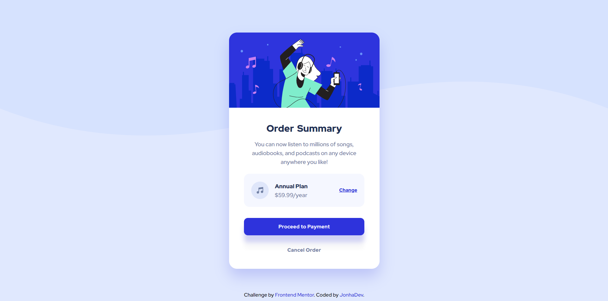

# Frontend Mentor - Order summary card solution

Esta es mi solución al reto de [Order summary card challenge en Frontend Mentor](https://www.frontendmentor.io/challenges/order-summary-component-QlPmajDUj). Aquí plasmaré los desafíos y aprendizajes a los que me enfrenté y la forma en que los abordé.

## Table of contents

- [Vista general](#vista-general)
  - [El reto](#el-reto)
  - [Screenshot](#screenshot)
  - [Links](#links)
- [Proceso](#proceso)
  - [Herramientas](#herramientas)
  - [Lo aprendido](#lo-aprendido)
  - [Lo que sigue](#lo-que-sigue)
  - [Recursos](#resources)

## Visión general

### El reto

Lo usuarios deben poder:

- Ver cambios de estado en algunos elementos al interacturar con ellos.
- Ver el componente en un dispositivo tanto móvil como de escritorio.

### Screenshot



### Links

- [Ver la solución en Frontend](https://www.frontendmentor.io/solutions/order-summary-comp-made-with-html-and-css-V1VlBWav-a)
- [Ver el proyecto en vivo](https://rad-youtiao-6afaee.netlify.app/)

## Proceso

### Herramientas

- HTML5 Semántico
- CSS
- Flexbox
- CSS Grid
- BEM
- Mobile-first workflow

### Lo aprendido

Trabajando en este proyecto me enfrenté a que no tenía idea de cómo ajustar el tamaño vertical para una imagen puesta de background. Aprendí el uso de varias propiedades background para manipular imágenes, darles diferentes tamaños y posiciones. También creo que voy comprendiendo un poco más el uso y buen manejo de la metodología BEM y me siento más cómodo trabajando con el Mobile-first workflow.

```css
body {
    background-image: url(/images/pattern-background-desktop.svg);
    background-size: 100% 45%;
  }
```

### Lo que sigue

Quiero terminar toda la sección de proyectos de nivel Newbie en Frontend Mentor y comenzar los proyecto de nivel Junior utilizando el preprocesador Sass que es la tecnología que quiero aprender a continuación.

### Recursos

- [Blog sobre Metodología BEM](https://platzi.com/blog/bem/) - Este es un blog que había guardado hace mucho y lo dejé para leerlo en el momento correcto. Me ayudó a orientarme y manejar un poco mejor la declaración de mis clases.
